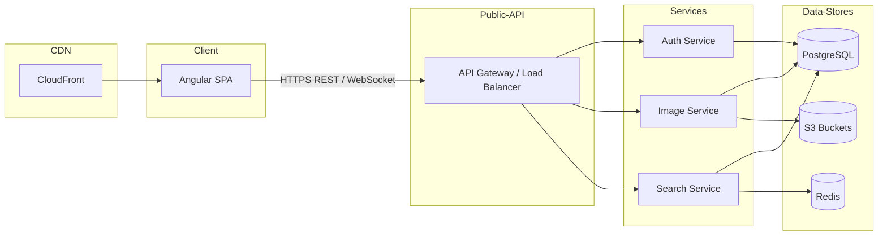

# System Design Specification

## 1. Architecture Overview

### 1.1 High-Level Architecture
We will build a single-page application (SPA) with an Angular front end and a Node.js/Express back end. The back end exposes a set of RESTful services for authentication, image management, and search. Static assets (SPA bundle) and user-uploaded images are stored in AWS S3 behind a CDN (Amazon CloudFront). A PostgreSQL database holds metadata (users, images), and Redis is used for caching frequently accessed data (e.g., recent searches). CI/CD, containerization, and orchestration are implemented via Docker, GitHub Actions, and Kubernetes/EKS respectively.

### 1.2 Architecture Diagram


### 1.3 Technology Stack

- **Frontend technologies**
  - Angular 16 with standalone components
  - Angular Material for UI  
  - RxJS for reactive data flows  
  - Tailwind CSS (optional utility classes)

- **Backend technologies**
  - Node.js 18+ with TypeScript  
  - Express.js  
  - Passport / JWT for authentication  
  - Sequelize or TypeORM ORM

- **Database systems**
  - PostgreSQL 14+ for relational storage  
  - Redis for caching and rate-limiting

- **Third-party services and APIs**
  - AWS S3 for object storage  
  - AWS CloudFront as CDN  
  - AWS SES or SendGrid for transactional email  
  - Google Analytics / Segment for user analytics

- **Development tools**
  - Git & GitHub  
  - Docker & Docker Compose  
  - Kubernetes (EKS)  
  - Helm for chart management  
  - Terraform for infra as code  
  - GitHub Actions for CI/CD  
  - Jest + Cypress for testing

---

## 2. Component Design

### 2.1 Frontend Components

- **AppComponent**  
  - Root shell, injects router outlet and header.  
  - Handles global error notifications.

- **HeaderComponent**  
  - Displays navigation links (Home, Search, Login/Logout).  
  - Subscribes to an AuthService for login state.

- **HomeComponent**  
  - Landing page.  
  - Provides drag & drop / click upload interface.  
  - Renders image grid (6-item maximum).  
  - Interacts with ImageService to upload/delete/persist images.

- **SearchComponent**  
  - Input field + result grid.  
  - Debounces user input (300ms) and calls SearchService.  
  - Paginates or infinite scroll results.

- **LoginComponent / RegisterComponent**  
  - Standard login and registration forms.  
  - Calls AuthService.

- **ImageDetailComponent**  
  - Modal or route-based detail view for a single image.  
  - Shows metadata and “Delete” button if authorized.

### 2.2 Backend Services

- **Auth Service**  
  - POST /api/auth/register  
  - POST /api/auth/login  
  - POST /api/auth/refresh  
  - GET /api/auth/me  

- **Image Service**  
  - Protected endpoints for image metadata CRUD.  
  - Generates pre-signed S3 URLs for uploads/downloads.  
  - Updates PostgreSQL metadata tables.

- **Search Service**  
  - GET /api/search/images?query=...&page=...  
  - Executes full-text queries on PostgreSQL or ElasticSearch (if scaled).  
  - Caches popular queries in Redis.

- **Gateway / API Layer**  
  - Express router with middleware chain: CORS → Logging → Auth (JWT) → Rate Limit → Route handlers.

### 2.3 Database Layer

- Use an ORM (TypeORM or Sequelize) to manage Models and Migrations.
- Data access patterns:
  - **AuthService**: simple find/create operations on Users.  
  - **ImageService**: transactional writes when generating metadata + S3 upload.  
  - **SearchService**: read-heavy full-text queries, use indexes.

---

## 3. Data Models

### 3.1 Database Schema

Users Table:
- id: UUID (PK)
- email: String, unique, indexed
- password_hash: String
- role: Enum('user','admin')
- created_at: Timestamp
- updated_at: Timestamp

Images Table:
- id: UUID (PK)
- user_id: UUID (FK → Users.id)
- key: String (S3 object key)
- url: String (public or CDN URL)
- filename: String
- content_type: String
- size: Integer
- created_at: Timestamp
- updated_at: Timestamp

SearchHistory Table (optional):
- id: UUID (PK)
- user_id: UUID (FK)
- query: String
- created_at: Timestamp

### 3.2 Data Flow

1. **Upload**  
   - Front end calls `POST /api/images/upload-url` → back end returns pre-signed S3 URL.  
   - Front end uploads image directly to S3.  
   - Front end calls `POST /api/images` with metadata → back end saves record.

2. **Display / Home Load**  
   - HomeComponent requests `GET /api/images?limit=6` → back end queries Images table → returns latest 6.

3. **Search**  
   - SearchComponent calls `GET /api/search/images?query=<term>` → back end executes full-text search → returns paginated results.

---

## 4. API Design

### 4.1 Endpoints

| Method | Path                         | Description                                        | Auth       | Request Body / Params                               | Response                                     |
|--------|------------------------------|----------------------------------------------------|------------|------------------------------------------------------|----------------------------------------------|
| POST   | /api/auth/register           | Create new user                                    | None       | { email: string, password: string }                  | { id, email, token }                         |
| POST   | /api/auth/login              | Authenticate user                                  | None       | { email: string, password: string }                  | { id, email, token, refreshToken }           |
| POST   | /api/auth/refresh            | Refresh JWT token                                  | None       | { refreshToken: string }                             | { token: string }                            |
| GET    | /api/auth/me                 | Get current user profile                           | Bearer JWT | —                                                    | { id, email, role }                          |
| GET    | /api/images                  | List images (with pagination)                      | Bearer JWT | ?limit=6&offset=0                                    | [{ id, url, filename, size, contentType }]   |
| POST   | /api/images/upload-url       | Get pre-signed S3 PUT URL                          | Bearer JWT | { filename: string, contentType: string }            | { uploadUrl: string, key: string }           |
| POST   | /api/images                  | Create image metadata after S3 upload              | Bearer JWT | { key: string, filename: string, size: number }      | { id, url }                                  |
| GET    | /api/images/:id              | Get image metadata                                 | Bearer JWT | —                                                    | { id, url, filename, size, metadata... }     |
| DELETE | /api/images/:id              | Delete image and S3 object                         | Bearer JWT | —                                                    | { success: boolean }                         |
| GET    | /api/search/images           | Search images by term                              | Bearer JWT | ?query=string&page=1&size=20                         | { total: number, results: [ImageMetadata] }  |

### 4.2 API Patterns
- Use **RESTful** conventions throughout.  
- JWT Bearer tokens in `Authorization` header.  
- Potential future GraphQL layer for aggregated queries.  
- Use WebSockets (Socket.io) for real-time notifications (e.g., image processing progress).

---

## 5. Security Design

### 5.1 Authentication Strategy
- **JWT** for stateless sessions.  
- Access tokens expire in 15m, refresh tokens expire in 7d.  
- Store refresh tokens securely in HttpOnly secure cookies.

### 5.2 Authorization
- **RBAC** with roles: `user`, `admin`.  
- Users can only operate on their own images.  
- Admins have override permissions.

### 5.3 Data Protection
- **HTTPS/TLS** enforced via CDN and load balancer.  
- **Encryption at rest**: S3 SSE-S3 or SSE-KMS, RDS encryption.  
- **Input validation & sanitization** using Joi or class-validator in DTOs.  
- **Rate limiting** (e.g., 100 requests/min per IP) via Express middleware.

---

## 6. Integration Points

### 6.1 External Services
- **AWS S3** for image storage (pre-signed URLs).  
- **AWS CloudFront** CDN for static assets and images.  
- **AWS SES** or **SendGrid** for account verification & notifications.  
- **Google Analytics** (front end) for page/interaction tracking.

### 6.2 Internal Integrations
- **Auth Service** ↔ **API Gateway** via JWT middleware.  
- **Image Service** invokes S3 SDK & ORM for metadata.  
- **Search Service** uses Redis cache for hot queries.

---

## 7. Performance Considerations

### 7.1 Optimization Strategies
- **Caching**  
  - Redis for query results and user session lookups.  
  - CDN caching for static assets and images.
- **Database indexing**  
  - Index `Images.user_id`, `Images.created_at`, full-text index on `filename` or `tags`.
- **Query optimization**  
  - Use pagination with indexed offsets or keyset pagination.
- **Lazy loading & code splitting**  
  - Angular lazy modules for Search, Profile, etc.

### 7.2 Scalability
- **Horizontal scaling** of Node.js pods via Kubernetes HPA.  
- **Load balancing** via AWS ALB or NLB.  
- **Database read replicas** for read-heavy workloads.  
- **Sharding** not required initially; consider partitioning by user_id if tables grow > billions of rows.

---

## 8. Error Handling and Logging

### 8.1 Error Handling Strategy
- Capture errors in Express with an `errorHandler` middleware.  
- Return consistent error envelope:  
  ```json
  {
    "status": "error",
    "code": "IMAGE_NOT_FOUND",
    "message": "No image found with id 1234"
  }
  ```
- Client displays user-friendly messages via a NotificationService.

### 8.2 Logging and Monitoring
- **Winston** on the server with log levels (error, warn, info, debug).  
- **Log aggregation** with ELK stack (Elasticsearch, Logstash, Kibana) or AWS CloudWatch.  
- **Metrics / APM** via Prometheus + Grafana or Datadog.  
- **Uptime monitoring** with Pingdom or AWS Route53 health checks.

---

## 9. Development Workflow

### 9.1 Project Structure

```
/
├── frontend/
│   ├── src/
│   │   ├── app/
│   │   │   ├── components/
│   │   │   ├── pages/
│   │   │   ├── services/
│   │   │   └── app.module.ts
│   └── angular.json
├── backend/
│   ├── src/
│   │   ├── controllers/
│   │   ├── services/
│   │   ├── models/
│   │   ├── middleware/
│   │   └── app.ts
│   └── Dockerfile
├── infra/            # Terraform / Helm charts
└── .github/
    └── workflows/    # CI/CD
```

### 9.2 Development Environment
- **Local setup**  
  - Node.js 18+, Angular CLI 16+  
  - Docker & Docker Compose for running Postgres & Redis.  
- **Env variables**  
  - `.env.local`, `.env.development`, `.env.production`  
  - AWS credentials, JWT secrets, DB URL.  
- **Configs**  
  - `angular.json` for base href and environment-specific builds  
  - `tsconfig.json` aligned with stricter lint rules  

### 9.3 Testing Strategy
- **Unit tests** with Jest (backend) and Jasmine/Karma (frontend)  
- **Integration tests**  
  - Test API endpoints against a test Postgres instance (Docker).  
- **E2E tests** with Cypress covering key user flows (login, upload, search).  
- **Coverage goal**: ≥ 80% for both frontend and backend.

---

## 10. Deployment Architecture

### 10.1 Deployment Strategy
- **CI/CD Pipeline** (GitHub Actions)  
  1. Lint & unit tests  
  2. Build Docker images & push to ECR  
  3. Run integration/E2E tests in ephemeral environment  
  4. Promote images to staging  
  5. Manual approval → deploy to production

- **Environments**  
  - `dev`: feature branches deployed automatically to test cluster  
  - `staging`: main branch, pre-production  
  - `production`: tagged releases

### 10.2 Infrastructure
- **Hosting platform**: AWS EKS (Kubernetes)  
- **Container strategy**  
  - Separate deployments for `frontend`, `backend-auth`, `backend-image`, `backend-search`  
  - Sidecar for log shipping (Fluentd)
- **Database hosting**: AWS RDS for PostgreSQL with Multi-AZ  
- **Storage**: AWS S3 buckets (versioned), CloudFront distribution  
- **Networking**: VPC with public/private subnets, NAT Gateways, security groups  

---

This design provides a practical, detailed, and flexible blueprint. It covers front-to-back implementation, embraces best practices (security, caching, observability), and allows iterative improvements as requirements evolve.